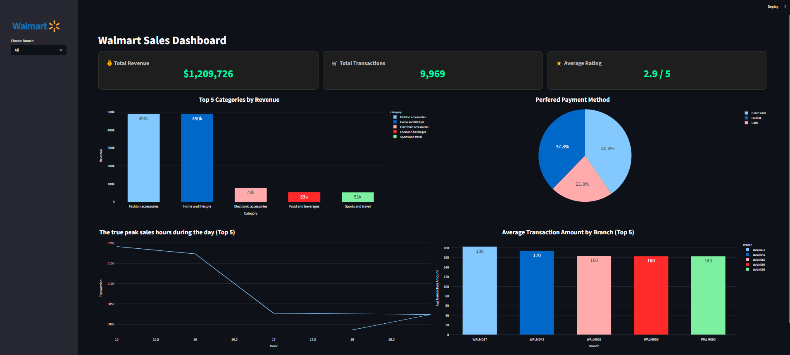
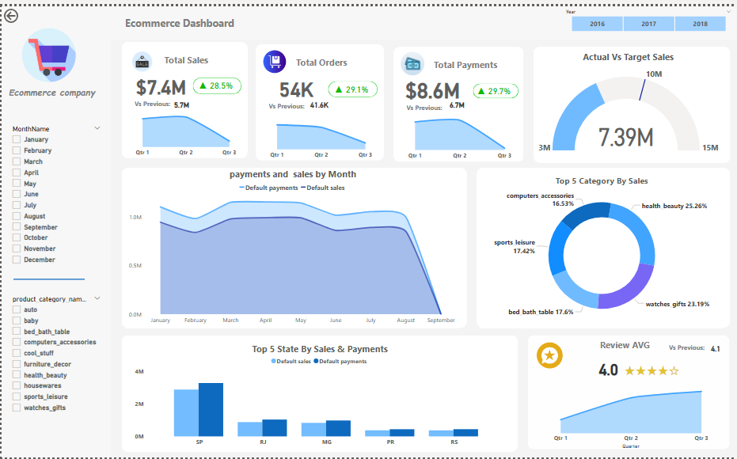

```md
<h1 align="center">Mohammed Khafagy</h1>

<h3 align="center">
Data Analyst • BI Developer • SQL Specialist • Data Warehouse Engineer
</h3>

<p align="center">
Building End-to-End Data Solutions from Raw Data to Business Decisions
</p>

<p align="center">
<a href="https://www.linkedin.com/in/mohammed-khafagy-7559aa272">

</a>

<a href="mailto:mohammedkhafagy045@gmail.com">

</a>

<a href="https://github.com/mohammedkhafagy752000">

</a>
</p>

---

## ⚙️ Tech Stack

<p align="center">


</p>

<p align="center">


</p>

---

## 💡 About Me

Data professional focused on designing and implementing end-to-end data solutions that transform raw operational data into reliable, decision-ready systems.

I specialize in:

- SQL Server Data Warehousing
- Python ETL / ELT Pipelines
- Business Intelligence Solutions
- Analytics Engineering
- Data Quality & Validation
- Advanced SQL Analytics

---

## 📊 Professional Snapshot

| Area | Expertise |
|--------|------------|
| 🏗 Data Warehousing | Star Schema, OLTP, OLAP |
| 🐍 Data Engineering | Python ETL Pipelines |
| 🗄 SQL Analytics | Window Functions, CTEs, PIVOT |
| 📊 BI Development | Power BI, Streamlit |
| 🧹 Data Quality | Validation & Cleaning |
| 🤖 Forecasting | LSTM, CNN Models |

---

## 📈 Career Highlights

✅ Built 3 End-to-End Analytics Solutions

✅ Designed Multiple Star Schema Data Warehouses

✅ Processed 70,000+ Transactions

✅ Analyzed $12M+ Revenue Data

✅ Built Real-Time Streamlit Dashboards

✅ Active Master's Researcher in Time-Series Forecasting

---

# 🚀 Featured Projects

## 🥇 Logistics End-to-End Data Warehouse

| Category | Details |
|-----------|-----------|
| Business Problem | 29.8% On-Time Delivery |
| Root Cause | 183 Minutes Detention Time |
| Opportunity | $2.52M |
| Architecture | OLTP + Star Schema DW |
| Technology | SQL Server, Power BI |

### Dashboard Preview

<p align="center">

</p>

<details>
<summary>View Full Project Details</summary>

PASTE YOUR CURRENT LOGISTICS PROJECT DESCRIPTION HERE

</details>

---

## 🥈 Walmart Retail Analytics

| Category | Details |
|-----------|-----------|
| Revenue Analyzed | $1.21M |
| Transactions | 9,969 |
| Branches | 100 |
| Dashboard Type | Real-Time Streamlit |
| Tech Stack | Python + SQL Server |

### Dashboard Preview

<p align="center">

</p>

<details>
<summary>View Full Project Details</summary>

PASTE YOUR CURRENT WALMART PROJECT DESCRIPTION HERE

</details>

---

## 🥉 E-Commerce Business Intelligence

| Category | Details |
|-----------|-----------|
| Revenue | $7.4M |
| Orders | 54,000+ |
| Architecture | Star Schema |
| Dashboard | Power BI |
| Focus | Category & Geographic Analytics |

### Dashboard Preview

<p align="center">

</p>

<details>
<summary>View Full Project Details</summary>

PASTE YOUR CURRENT E-COMMERCE PROJECT DESCRIPTION HERE

</details>

---

## 📊 Dashboard Gallery

<table>

<tr>

<td width="50%">

</td>

<td width="50%">

</td>

</tr>

<tr>

<td width="50%">

</td>

</tr>

</table>

---

## 🔬 Master's Research

### Commodity Price Forecasting using Deep Learning

Research Focus:

- LSTM Networks
- CNN Models
- Event-Aware Forecasting
- Time-Series Analysis
- Commodity Price Prediction

Current Work:

Developing forecasting models that integrate external events into commodity price prediction systems.

---

## 📚 Education

### Master of Computer Science (Data Science)

Damietta University | 2022 – Present

Research Area:

Time-Series Forecasting & Deep Learning

### Bachelor of Computer Science

Damietta University

Top of Class 2022

GPA: 3.34 / 4.0

---

## 📜 Certifications

- SQL Advanced — HackerRank
- Transact-SQL Queries — Mahara Tech
- Intermediate SQL Server — DataCamp
- Power BI — 365 Data Science
- EDA in Python — DataCamp
- Python for Data Science — Coursera

---

## 📈 GitHub Statistics

<p align="center">


</p>

---

## 🤝 Let's Connect

📧 mohammedkhafagy045@gmail.com

📱 +20 10 2739 2515

🔗 LinkedIn:
https://www.linkedin.com/in/mohammed-khafagy-7559aa272

💻 GitHub:
https://github.com/mohammedkhafagy752000

---
```
